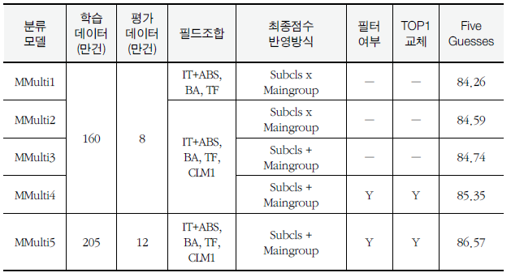

# Paper review

## 한국어 특허 문장 기반 CPC 자동분류 연구  - 인공지능 언어모델 KorPatBERT를 활용한 딥러닝 기법 접근 -
- **요약** : 4차 산업혁명과 맞물려 다양한 신기술 출현으로, 지식재산권의 확보는 국가 및 기업의 기술 경쟁력 유지 및 신성장 동력 구축에 있어 중요성이 날로 커지고 있다. 그중 특허는 보유기업의 핵심 기술을 포함하고 있는 문서로서, 기업 가치 측정 및 경쟁 기술분야 분석에 많이 활용되고 있다. 이러한 특허 분석을 효율적으로 진행하기 위해서 최신 및 상세한 기술분야를 포함한 CPC(선진특허분류)가 개발되었다. CPC는 현존하는 특허분류체계 중 가장 세분화된 코드 수를 가지고 있고, 현재까지 전 세계 6,200만 건 이상의 문헌들 이 CPC로 분류되었다. 매해 신규 특허출원의 CPC 분류를 위해 전 세계 특허 출원의 약 80% 이상을 차지하는 선진 5개 특허청을 중심으로 많은 예산과 인력을 투입하고 있으며, 최근 인공지능 기술을 활용한 자동화된 분류 모델 에 대한 연구·개발을 추진 중에 있다. 본 연구에서는 키워드의 한계를 벗어나 문맥과 문장에 내포된 의미를 이해하는 인공지능 언어모델인 BERT 기반의 특허문헌 사전학습을 진행하여, 특허분야에서 기존 모델 대비 우수한 KorPatBERT를 생성하였다. 그리고 CPC 코드별 불균형적인 데이터 분포를 완화한 효과적인 분류 학습데이터 셋 구축방안을 제안하고 생성하였다. 최종적으로 실서비스 가능한 수준의 CPC 서브클래스 및 메인그룹의 분류를 가능케 하는 모델을 생성하였고, 객관적인 평가지표를 통하여 그 실효성을 성공적으로 검증하였다. 이러한 연구를 통하여 향후 한국어 특허 기반 분류 및 자연어처리 관련 분야의 지속가능한 발전에 기여하고자 한다.

- **논문링크** : https://www.kci.go.kr/kciportal/ci/sereArticleSearch/ciSereArtiView.kci?sereArticleSearchBean.artiId=ART002878048
- **수상** : [2022 비법학 분야 최우수 논문상](img/award.png) 
- **논문지** : 지식재산연구 제 17권 제 3호 209p~256p
- **저자** : **박진우(공동1저자), 심우철(공동1저자),** 이상헌, 고봉수, 노한성(교신저자)
- **키워드** : `KorPatBERT`, `CPC`, `자동 특허 분류`, `멀티 라벨`, `IPC`, `특허`, `버트`, `인공지능`

---

## 1. Dataset 
### 1.1 특허문서 구조
&nbsp;&nbsp;한국 특허문서는 아래와 같이 크게 서지정보, 명칭, 요약, 대표도, 청구항, 명세서 등의 구성요소들을 내포하고 있다. 본 연구에서는 특허분야에 존재하는 다양한 자연어처리 태스크 해결을 위한 **KorPatBERT 언어모델** 을 학습하기 위하여,  전체 구성요소 내에 존재하는 텍스트 데이터들을 추출하여 언어모델 사전학습에 사용하였다. 반면에,  **CPC 분류모델** 학습을 위해서는 명칭과 요약을 하나로 합친 **명칭·요약 필드와 배경기술, 기술분야, 청구1항** 총 5개의 일부 필드들을 학습에 사용하였다. 이와 같이 언어모델 학습에 더 많은 필드들을 사용한 이유는, 언어모델의 경우 분류를 포함한 여러 자연어처리 태스크를 위해 사용되는 모델이기 때문이다.

	

 <b><i><특허문서의 구조></i></b>

<!-- -->

### 1.2 KorPatBERT 언어모델 학습 데이터
&nbsp;&nbsp;KorPatBERT를 Scratch 사전학습 하기 위한 데이터는 2018년도 기준 국내 전체특허공보 문헌을 대상으로 수집하였다. 해당 문헌은 국제특허기구(WIPO)에서 정한 세계특허정보표준(ST.96) 기반의 XML 형식으로 작성되었다. 언어모델 학습을 위하여 해당 문헌내에 자연어의 형태로 존재하는 16개 태그를 기준점으로 문장데이터 추출을 진행하였다. 그 결과 **약 406만 문헌**에서 **약 4억 6천만 문장**이 수집되었다. 그리고 Image 태그, 불용 특수문자, 개행문자 등 학습 저해 요소로 판단되는 문자열들의 정제를 거쳐 최종 **120GB** 크기의 학습데이터를 구축하였다.

	

 <b><i><사전학습용 특허문헌 통계></i></b>

 <b><i><학습데이터 문자열 정제사항></i></b>

### 1.3 CPC 분류 모델 학습 데이터
&nbsp;&nbsp;본 연구에서 CPC 분류모델들을 학습하기 위한 데이터 유형은 아래와 같이 3가지가 존재한다.

> * **서브클래스 주분류 모델 학습데이터 (Multi-class 분류)**
> * **서브클래스 주·부분류 모델 학습데이터 (Multi-label 분류)**
> * **메인그룹 주·부분류 모델 학습데이터 (Multi-label 분류)**

#### 1.3.1 데이터 불균형성 완화
&nbsp;&nbsp;전체 데이터는 2010년-2021년간의 **특허데이터 205만건**을 기준으로 학습데이터(2010년-2018년), 평가데이터(2019년-2021년)로 구분지어 최종 구축하였다. Multi-class 분류는 특허문헌에 부여되어 있는 1개의 주분류 코드를 기준으로 학습과 평가 데이터를 균형있게 구축하는데에 큰 어려움이 없다. 하지만 Multi-label 분류의 경우, 특허 1개의 문헌에 복수개의 코드가 부여되어 있어 주분류만을 기준으로 학습과 평가 데이터를 나누는 경우 특정 코드들의 데이터들이 부족하거나 과해지는 경우가 발생하다. 그래서 Multi-label 분류의 경우 아래와 같이 4단계의 과정을 거쳐 이러한 불균형성을 완화시켰다.

> * **1단계) 연도별 데이터 분리, 학습데이터(2010년-2018년), 평가데이터(2019년-2021년)**
> * **2단계) 코드별 100건 미만인 경우, 1968년~2010년 데이터에서 부족문헌 보강 (보강 이후 5건 미만은 레이블에서 제외)**
> * **3단계) 평가데이터 내 코드별 문헌수가 학습데이터 대비 월등히 많은 경우 일부를 학습데이터로 이동**
> * **4단계) 평가데이터 내 코드별 문헌수가 0건이거나 학습데이터 대비 현저히 적을 경우 학습데이터의 일부를 평가데이터로 이동**

#### 1.3.2 데이터 추출 및 레이블링
&nbsp;&nbsp;데이터 추출은 CPC 분류에 대한 선행연구결과를 참조하여, 특허문헌 내의 해당기술에 대한 핵심적인 기술요소를 내포하고 있는 **"발명의명칭", "요약", "기술분야", "배경기술", "청구1항"** 필드를 추출대상으로 선정하였다. 그리고 발명의 명칭의 경우 다른 필드보다 상대적으로 문장길이가 짧아, 그 의미가 좀 더 확장되어 있는 "요약"을 이어 붙여 하나의 문장으로 구성하였다. 그리고 1990년 이후 출원된 국내 특허문헌 약 330만건의 통계를 확인하여 보면, **서브클래스의 경우 94.6% 문헌들이 3개 이하**의 코드가 부여되어 있고, **메인그룹의 경우 94.1% 문헌들이 5개 이하**의 코드가 부여되어 있다. 그레서 데이터 레이블링은 서브클래스의 경우 최대 3개, 메인그룹의 경우 최대 5개의 CPC를 활용하여 데이터 레이블링을 진행하였다. 

	

 <b><i><CPC 분류 학습데이터 추출 대상 필드></i></b>

 <b><i><한 문헌당 최대 CPC 코드 개수에 따라 전체 특허문헌 대비 커버리지></i></b>
	

#### 1.3.3 데이터 구축 결과
&nbsp;&nbsp;위와 같은 데이터 불균현성 완화 과정과 추출, 레이블링을 거쳐 아래와 같이 서브클래스 주분류의 경우 **632개**, 주·부분류의 경우 **662개**, 메인그룹 주·부분류의 경우 **10,327개**의 레이블을 가지는 CPC 분류 모델 학습데이터를 최종 구축하였다.

 <b><i><CPC 분류 학습, 평가 데이터 통계></i></b>

---
	
## 2. Experiment
### 2.1 KorPatBERT 언어모델
&nbsp;&nbsp;Google에서 2018년도 공개한 `BERT(Bidirectional Encoder Representations from Transformers)` 언어모델은 영어로 작성된 범용목적의 데이터를 사전학습 한 모델이며, 한국어 만을 대상으로 학습한 별도 모델은 공개되어 있지 않다. (한국어를 포함한 104개의 언어를 학습한 Multilingual 모델은 존재) 그래서 최근 연구에 의하면 Domain adaptive or Task adaptive 데이터를 사전학습한 경우에 그 성능이 더욱 준수한 것으로 알려져 있어, 본 연구에서는 특허분야의 다양한 자연어처리 문제해결을 위해, 특허 도메인 데이터들을 대량으로 학습한 **Scratch 버전의 KorPatBERT**를 생성하였다.

	

 <b><i><KorPatBERT 사전학습 과정></i></b>
	

#### 2.1.1 사전학습
* **토큰화 과정**
	* 한국어 및 특허분야에 특화된 **MSP Toknizer(Mecab-ko Sentencepiece Patent Tokenizer)**를 사용
	* 1차 한국어 형태소 기반 분리(Mecab-ko 형태소 분석기) -> 2차 Subword BPE 기반 분리(Google SentencePiece)
	* 수집된 학습데이터 기반 약 **660만개의 특허분야 명사 및 복합명사**를 Mecab-ko 사용자 사전 추가
	* **21,400 개**의 SentencePiece Vocabulary 사용
* **주요 파라미터**

	

 <b><i><KorPatBERT 사전학습 주요 파라미터></i></b>
	

* **학습환경**
	* NVIDIA Tesla V100 32GB X 8 사용하여 학습
	* FP16 연산을 위한, NVIDIA AMP(Automated Mixed Precision)를 사용
	* "Horovod" distributed training library 사용
	* 128 Sequence 230만 Step 학습 -> 512 Sequence 75만 Step 학습
* **학습결과**
	* MLM Accuracy **83.42%**
	* NSP Accuracy **99.50%**

#### 2.1.2 다운스트림 태스크 평가
&nbsp;&nbsp;CPC 분류모델 학습데이터 중 서브클래스당 문헌이 최대 3천건 이상인 코드를 기준으로, 데이터를 균등하게 샘플링하여 다운스트림 태스크용 학습데이터를 구축하였다.
이후 비교평가를 위해 **동일한 기준으로 Google BERT, ETRI KorBERT, KorPatBERT**를 학습시켰다. 결과적으로 KorPatBERT 모델이 **Google BERT 모델 대비 약 3.7% ↑** 높은 성능을 보였으며, 이러한 결과를 통해, **도메인과 언어에 특화된 학습을 수행한 언어모델이 관련 도메인에 더욱 적합**한 모델임을 확인할 수 있다.

	
**[다운스트림 태스크 학습데이터]**

 <b><i><다운스트림 태스크 학습데이터></i></b>

 <b><i><다운스트림 태스크(CPC분류) 성능평가 결과></i></b>	

### 2.2 CPC 분류모델
&nbsp;&nbsp;CPC 분류모델은 구축되어진 약 205만건의 문헌별 학습데이터와 도메인 특화된 사전학습이 완료된 KorPatBERT를 활용하여 학습을 수행하였다. 

#### 2.2.1 분류모델 학습
* **전처리 과정**
	* MSP 토크나이저를 기준으로 토큰화 -> 모델입력을 위한 인코딩 (최대 256 Sequence)
	* 데이터별 매핑된 CPC 레이블들은 레이블-맵을 활용하여 One-hot 형태로 인코딩
* **학습모델 구성**
	* 메인그룹은 **서브클래스의 종속적인 관계 & 메인그룹별 학습데이터 부족 & 메인그룹 분류종수는 10,327종**
	* 위와 같은 제한적 요인으로 메인그룹 레벨 분류를 **1개의 모델로 진행하기에는 적합하지 않은것**으로 판단됨
	* 서브클래스 분류(662종) 후 메인그룹 분류(평균 15종)를 하는 **순차적 접근방식**이 유효
	* 서브클래스 주분류 및 주·부분류 모델은 각각 1개의 모델 학습 진행
	* 메인그룹 주·부분류 모델은 **서브클래스 662종에 각각 해당 되는 메인그룹 분류모델** 학습 진행
 	 (KorPatBERT 사전학습과 동일한 인프라 환경에서 학습 진행)
	

 <b><i><CPC 분류모델 구성></i></b>	

	
* **주요 파라미터**

 <b><i><CPC 분류모델 학습 주요 파라미터></i></b>	

	
	
* **전체 학습과정**
	* 입력데이터 별로 KorPatBERT 언어모델을 통과하여 나온 최종 레이어의 **"[CLS]" 토큰(Context Vector)** 추출
	* 이후 **레이블 수만큼의 차원**을 갖는 Dense layer 연결과 Activation function을 통하여 결과값을 도출
	* 서브클래스 주분류 모델 (Softmax), 서브클래스 주·부분류 & 메인그룹 주·부분류 (Sigmoid)
	* Categorical cross entropy loss를 통한 손실 측정
	

	

 <b><i><CPC 분류모델 학습 프로세스></i></b>	
	

#### 2.2.2 Prediction
&nbsp;&nbsp;CPC 분류 예측 과정은 크게 3단계로 나누어져 진행된다. 첫째, 서브클래스의 주분류와 주·부분류를 예측하여 TOP3의 서브클래스 코드를 선정한다. 둘째, 예측된 서브클래스들을 기준으로 각각의 메인그룹 주·부분류 TOP3를 예측한다. 셋째, 예측된 결과들을 토대로 병합 및 랭킹을 수행하여 최종 분류코드를 도출한다. 각각의 과정별 세부사항은 아래와 같다.

* **서브클래스 예측**
	* "발명의명칭+요약", "배경기술", "기술분야" 필드들의 **서브클래스 주분류와 주·부분류 코드를 예측**한다.
	* 주분류 모델을 통해 나온필드별 **예측확률을 병합**하고, 필드별 길이에 대한 가중치를 합산한다
	* 주·부분류 모델을 통해 나온필드별 **예측확률을 병합**하고, 필드별 길이에 대한 가중치를 합산한다.
	* 주·부분류 모델의 예측결과 TOP3 중 TOP1의 결과를 주분류 모델의 **TOP1 결과로 치환**한다.
	* 최종 TOP 3 서브클래스 코드를 결과를 메인그룹 모델쪽으로 전달한다.
* **메인그룹 예측**
	* 서브클래스 예측단계에서 전달받은 **TOP3 서브클래스 코드를 기준**으로 각각의 메인그룹 분류코드 TOP3를 예측한다.
	* 메인그룹 예측단계에서는 **"청구1항" 필드를 추가**하여 예측을 진행한다.
	* 필드별 예측 확률 병합은 서브클래스 과정과 동일하게 수행된다.
	* 최종 서브클래스 TOP3 코드별 메인그룹 TOP 3 코드를 선정한다.
* **결과 병합 및 랭킹**
	* **서브클래스 예측단계에서 도출된 스코어와 메인그룹 예측단계에서 도출된 코드별 스코어**를 모두 합산한다.
	* 최종 선정된 최대 9개의 메인그룹 코드별 스코어를 기준으로 정렬하여 순위를 확정한다.
* **전체 예측과정**

	

 <b><i><CPC 분류모델 예측 프로세스></i></b>	
	

---	
	
## 3. Evaluation
### 3.1 평가방식
&nbsp;&nbsp;WIPO의 인공지능 기반의 IPC 자동분류 도구인 **IPCCAT의 분류모델 예측성능을 평가하는 방식**을 레퍼런스로 하여, 아래와 같이 각각의 모델 유형별 평가방식을 선정하였다.
* **서브클래스 주분류 모델 - TOP Prediction**
* **서브클래스 주·부분류 모델 - Three Guesses (=TOP3 Recall)**
* **메인그룹 주·부분류 모델 - Five Guesses (=TOP5 Recall)**

 <b><i><CPC 분류모델 평가 방식></i></b>	

### 3.2 평가결과
#### 3.2.1 서브클래스 주분류 모델
* 도메인 특화된 KorPatBERT 모델이 범용목적의 Google BERT 대비 **↑6.97** 성능이 우수한 것을 확인
* **"발명의명칭+요약", "배경기술", "기술분야"** 필드를 학습한 경우 "발명의명칭+요약" 보다 **↑2.15** 성능 향상 확인
* **학습데이터 증가**에 따라 **모델 성능이 증가**하는 것을 확인
* 최종 205만 문헌 학습, 12만 문헌 평가 결과 - **TOP Prediction 78.63**

 <b><i><서브클래스 주분류 모델 평가></i></b>	

	

#### 3.2.2 서브클래스 주·부분류 모델
* 주분류 모델 대비 30종이 늘어난 662종의 서브클래스 주·부분류 학습 모델
* 동일 데이터셋 기준 TOP Prediction 결과는 주분류 모델이 우세함을 확인
* **"청구1항" 필드를 추가하여 학습**한 경우 서브클래스 단위에서는 오히려 **↓0.03** 성능이 감소함을 확인
* 학습데이터 증가에 따라 모델 성능이 증가하는 것을 확인
* 최종 205만 문헌 학습, 12만 문헌 평가 결과 - **Three Guesses 93.85**

 <b><i><서브클래스 주·부분류 모델 평가></i></b>		

	

#### 3.2.3 메인그룹 주·부분류 모델
* "청구1항" 필드를 추가하여 학습한 경우 **↑0.33** 성능이 향상됨을 확인 (서브클래스와 대비됨)
* 분류종수가 10,327종으로 서브클래스 대비 약 15배 세분화되어 "청구1항"의 세분화된 기술내용이 효과적인 것으로 판단됨
* 최종 205만 문헌 학습, 12만 문헌 평가 결과 - **Five Guesses 86.57**

 <b><i><메인그룹 주·부분류 모델 평가></i></b>		

	
### 3.3 분석
* 기술분야별 메인그룹 평가 결과 **A(생활필수품), H(전기) 섹션이 90% 이상**으로 상대적으로 높음
* **D(섬유, 지류), B(처리조작) 섹션의 경우 80% 이하**로 성능이 타 섹션대비  다소 떨어짐
* 섹셜별 **학습데이터의 양이 많고, 섹션별 하위에 해당 되는 분류 개수가 적을수록** 성능에 비례하는 결과를 보임
* 예를 들면, H섹션의 경우 전체의 21% 학습데이터 비중이 가장 크고, D섹션의 경우 2%로 학습데이터 양이 가장 적음
* B섹션의 경우 학습데이터가 17% 비중으로 많지만, 하위 분류개수가 전체에서 27%로 가장 많음

 <b><i><CPC 섹션별 최종 평가 결과></i></b>
  

 <b><i><CPC 섹션별 서브클래스 & 메인그룹 & 학습데이터 점유율></i></b>	

---

## 4. Conclusion
* 특허문헌 내에 존재하는 자연어 데이터를 기반으로 도메인 특화된 **KorPatBERT 언어모델 생성 및 우수성 입증**
* **자동화된 인공지능 CPC 자동분류 모델**학습에 유효한 데이터 셋 구축방안을 제안
* 효과적인 CPC 자동분류를 위한 **서브클래스, 메인그룹 단계별 순차적 접근방식**을 제안
* 언어모델과 분류 데이터셋을 이용한 **CPC 자동분류 모델 구축 및 최적화, 비교평가**로 그 실효성을 검증
* 국내 연구사례 중 한국어 특허문헌 CPC 메인그룹 단위까지의 분류연구는 **선행사례를 찾아보기 어려움**
* 본 연구를 통해 향후 더욱 세분화되고 정확도가 높은 특허분류 연구를 진행하는 연구자들에게 좋은 레퍼런스가 될거라 기대함.
