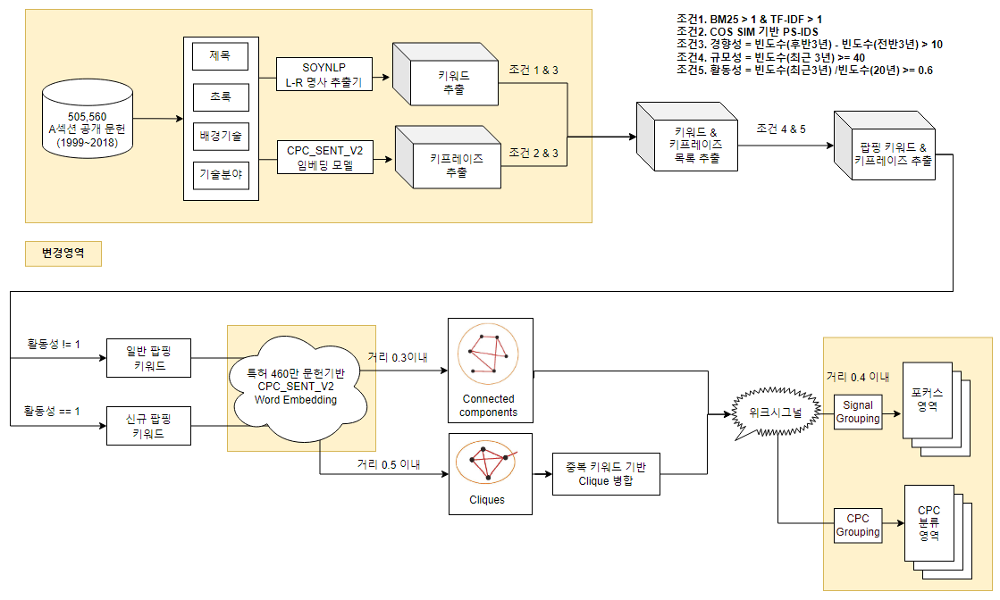
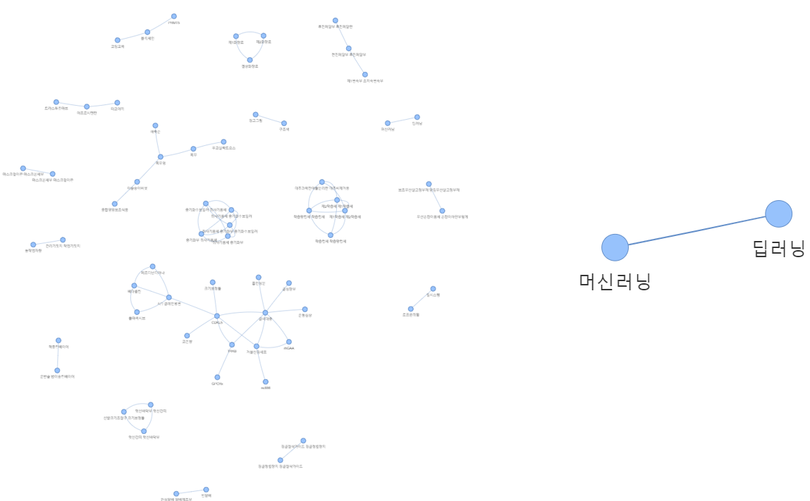

# 특허 DATA를 활용한 미래기술 위크시그널 분석1 - 키프레이즈 기반으로</img>

# Preview

- **제목** :  '[**특허 DATA의 키워드를 활용한 미래 기술 위크시그널 분석**](#)'
- **요약** : 현재 중요성을 아직 판단하기 어렵지만 잠재력에 대한 정보를 내포하고 있는 작은 신호 또는 징후를 위크시그널이라고 부릅니다. 특허는 매우 세밀한 기술적 특징을 담고 있는 문서로, 한국특허정보원에서는 국내 특허DATA의 키워드를 활용하여 위크시그널 판단 가능성을 확인하고자 합니다. 본 연구에서는 특허 기술분류 코드인 CPC에서 A섹션만을 대상으로 수행하였고 1999년부터 2018년간 약 50만 건의 문서에서 기술 키워드와 구문을 6,150만 개 추출하였습니다. 이 키워드와 구문의 조합으로 새로운 기술을 그래프로 만들었고 이것을 위크시그널로 표현하였습니다. 기존 방법과 다른점은 키워드와 키프레이즈라고하는 구문을 추출하는 방법입니다. 명사를 추출할 때 L-[R] 그래프 구조로 통계적 원리를 활용하였고 특허문헌을 학습한 BERT 언어모델을 활용하여 키프레이즈를 추출하였습니다. 또한 기술그룹 구축을 위한 유사성을 판단할 때도 특허 BERT 언어모델을 활용한 점이 다른 점이라고 할 수 있습니다. 특허 키워드 추출방법, 언어모델 활용 등 특허문헌의 자연어 처리 노하우를 접목하여 미래 기술 위크시그널을 분석하는 점에서 의미있는 접근 방법이고 시도라고 볼 수 있습니다. 이러한 연구를 통해서 향후 특허 기반 인공지능 분석 관련 분야의 발전에 기여하고자 합니다.

- **연구부서** : 한국특허정보원 지능정보전략팀 연구실증파트
- **연구자** : 민재옥, 박진우, 심우철, 김채은, 황솔빈

---

# Reference

> 이 글은 '[**KISTI DATA INSIGHT 제19호 : 미래기술 위크시그널 성장예측보고서**](https://www.kisti.re.kr/post/data-insight?t=1668036309836)'와 
> '[**KISTI DATA INSIGHT 제15호 : 미래기술 위크시그널**](https://www.kisti.re.kr/post/data-insight?t=1668036309836)'의 내용을 인용하였습니다.
> 아래 설명하는 실험들은 특허데이터만을 적용한 내용입니다.
> 또한 KISTI 미래기술 위크시그널 분석 방법이나 데이터에서 차이가 있음을 미리 알려드립니다. 

- **참고보고서 링크** : https://www.kisti.re.kr/post/data-insight?t=1668036309836
- **보고서** : KISTI DATA INSIGHT 제19호 : 미래기술 위크시그널 성장예측보고서
- **저자** : 양혜영, 하태현, 홍성화, 김소영

---

# 1. 미래기술 위크시그널 - 키워드 활용편
## 1.1. 위크시그널
> 위크시그널의 개념은 전략적 관리자로 알려진 Ansoff의 "Managing Strategic Surprise by Response to Weak Signals"라는 논문에서 기업이 외부변화로부터 받게 될 충격을 관리하기 위
> 해 충격을 야기할 수 있는 작은 신호로 사용되었습니다. 경험적 외삽으로는 설명하기 어렵고 그 중요성이 불분명하지만, 미래에 일어날 일들에 대한 정보를 담고 있는 작은 징후로 보기도 
> 합니다. 따라서 예전에는 전문가들이 토론을 거쳐서 결정하였고 급변하는 기술환경에서 빠르게 자동으로 판단하기 쉽지 않았습니다. 이에 따라 KISTI연구진은 위크시그널을 자동 탐지하는 방
> 법을 시도해보았고 한국특허정보원에서도 국내 특허데이터로 실험을 진행해보았습니다.

### 1.2 위크시그널 자동탐지 프로세스
이 글에서는 혼동을 방지하기 위해 참고한 KISTI 미래기술 위크시그널 방식은 'KISTI 위크시그널'로 명명하고 특허데이터를 적용한 방식은 'KIPI 위크시그널'로 구분하여 설명드리겠습니다.

> ```KISTI 위크시그널 자동탐지 프로세스```
<p align="center">
</img>
</p>
</br>
</br>

> ```KIPI 위크시그널 자동탐지 프로세스```

> 우선 KISTI 프로세스와 다른 점은 키워드와 구문(=키프레이즈) 추출 부분입니다. n-gram 방식으로 키워드를 추출하는 방식에서 LTokenizer를 통해 통계기반으로 명사를 추출하게 되었고, BERT 임베딩 모델을 활용하여 키프레이즈(=구문)을 추출하는 방법에 있습니다. 또한 특허 내에 제목, 초록 뿐만아니라 배경기술, 기술분야의 내용에서도 뽑아내는 점이 변경영역으로 볼 수 있습니다. 나머지 프로세스들은 데이터의 규모나 특허데이터라는 특성만 다른뿐 비슷한 형태를 지니고 있습니다.

<p align="center">
</img>
</p>

# 2. 위크시그널 자동탐지 실험

## 2.1 실험 데이터

- 1999년 ~ 2018년 (출원연도 기준)
- 특허 공개공보 데이터 
- CPC(Cooperative Patent Classification)에서 A section인 건만 대상
- 전체 3,360,316건 중 505,560건
- 대상 필드는 발명의 명칭, 요약, 배경기술, 기술분야로 적용

<p align="center">
</img>
</p>
</br>

## 2.2 키워드 추출

> ```SoyNLP L-[R] 명사 추출기 사용```

- 버전 : SoyNLP 0.0493
- 통계기반의 미등록 용어문제 해결, L-[R] Graph 구조를 활용한 명사 추출
- Noun Extractor를 이용한 명사 및 복합명사 추출 → LTokenizer를 이용한 단어 분리(KorPatBERT Tokenizer에서도 Mecab형태소 분석기 사용자 사전 용어 등록 시 활용)
- LTokenizer 사용자 사전 명사 : 684,938건
- 복합 명사 : 954,691건 
- 684,938 + 954,691 = 1,589,576건

<p align="center">
</img>
</p>
</br>

## 2.3 키프레이즈 추출

> ```KorPatBERT CPC 분류기 모델 사용```

- 대상필드 : 제목, 요약, 배경기술, 기술분야
- 워드단위 < 프레이즈 < 문장단위
- 약 2~10 내의 단어로 이루어진 의미적으로 완전한 어구

<p align="center">
</img>
</p>
</br>

## 2.4 Poping 키워드 추출

> ```Poping 키워드 후보 추출 조건```

> BM25와 TF-IDF는 정규화를 통해 최대값이 1이 되게 nomalize하였고 이 중 최대값에 해당하는 것만을 기본적으로 추려서 후보로 뽑았습니다. 경향성의 경우 KISTI에서 있던 경향성의 통계적 비율과 동일하게 뽑기위해 후반 3년 빈도수가 10번 더 나온 경우로 정하여 추출하였습니다.

- (BM25 == 1) or (TF-IDF == 1)
- 경향성 = 빈도수(후반3년) - 빈도수(전반3년) > 10

> ```Poping 키워드 추출 조건```

- 규모성 = 빈도수(최근3년) >= 40
- 활동성 = 빈도수(최근3년/20년) >= 0.6

<p align="center">
</img>
</p>
</br>

> ```경향성 10초과 키워드 [135,809건] 대상```

> 1999년부터 2018년까지 A 섹션 출원한 문헌이 505,506건인데 이 중 키워드로 치면 중복제거하고 386,904건이 됩니다. 이때 BM25 값이 1인 경우는 65,243건이 되고 경향성이 10초과 되는 건은 16,107건이 됩니다. 이 16,107건의 키워드가 팝핑 키워드 후보가 될 것이고 팝핑 키워드 조건인 규모성이 40이상이고 활동성이 0.6이상인 것이 766건이 나오게 됩니다.

<p align="center">
</img>
</p>
</br>

> ```Poping 키워드 추출 결과```

> 팝핑 키워드 후보 16,107건 중 활동성이 0.6이상인 건 3,741건이고 이 중 규모성이 40이상인 걸 뽑으면 766건이 팝핑 키워드로 추출됩니다. 아래 실제 BM25 기반과 TF-IDF기반으로 팝핑 키워드가 결과로 뽑힌 예시를 볼 수 있습니다.참고로 TF-IDF기반만으로 경향성, 규모성, 활동성 조건들을 필터로 팝핑 키워드를 뽑게되면 656건이 뽑히게 됩니다.

<p align="center">
</img>
</p>
</br>

<p align="center">
</img>
</p>
<p align="center"> < BM25기반, TF-IDF기반 Poping 키워드 예시></p>
</br>

## 2.5 Poping 키프레이즈 추출

> ```PS-IDS```

> 이번에는 팝핑 키프레이즈 후보를 추출하기 위해 PS-IDS로 대상 건을 추려낼 것입니다. PS-IDS는 TF-IDF와 원리는 같지만 내용을 변형한 형태로 보시면 됩니다. 키프레이즈가 문서와 얼마나 유사한지를 위한 공식으로 만들었고 이를 통해 후보를 추출 할 것입니다. 

- PS(Phrase Similarity) : 키프레이즈-문서간의 유사도
- IDS(Inversed Document Similarity) : 키프레이즈와 총문서들간의 유사도 역수
- TF-IDF의 term을 키프레이즈로 변경

<p align="center">
</img>
</p>

> ```Poping 키프레이즈 후보 추출 조건```

> 문헌 당 Top200의 키프레이즈를 뽑았기 때문에 평균적으로 200건이 있고 총 60,633,476건의 키프레이즈가 있습니다. 이때 팝핑 키프레이즈 후보를 추출하기 위해 PS-IDS값에 log값을 씌워 0.67보다 큰 경우 73,313건이 나오게 됩니다. 또한 추가적인 조건으로 키워드 별 경향성의 합이 0보다 큰 경우 규모가 더 줄어들어 결국 팝핑 키프레이즈 후보가 21,880건이 됩니다. 

- Log & Max scaling 기준 > 0.67 키프레이즈 : 73,313건
- 프레이즈 내부 키워드 별 경향성 합계 > 0  : 21,880 건

<p align="center">
</img>
</p>

> ```Poping 키프레이즈 추출 조건```

> 이제 팝핑 키프레이즈 후보 21,880건을 뽑았고 이 중 팝핑 키프레이즈 조건으로 규모성과 활동성을 적용하여 대상건을 추출하겠습니다. 규모성은 9이상이고 활동성이 0.5이상인 것은 약 2.6%로 575건이 키프레이즈로 뽑히게 됩니다. 

<p align="center">
</img>
</p>


## 2.6 Poping 키워드&키프레이즈 검증

> 팝핑 키워드 766건, 팝핑 키프레이즈 575건 합계 1,341건이 추출되었고 이 건들에 대해 면밀히 확인해보았습니다. 결과로 추출된 팝핑 키워드 & 키프레이즈 A 섹션의 클래스 별 건수가 A섹션 출원 대비 통계적으로 크게 벗어나지 않은 결과를 보였고, 메인 클래스 기준으로 보았을 때, 상위 6개의 경향이 일치한 것을 알 수 있었습니다. 특이한 것은 A24의 경우 타분류와 대비성이 강한 특징으로 유달리 높은 유사도 결과를 보였는데 CPC 정의서를 보면 A24는 '담배;엽권담배; 지권담배; 흡연용구'를 의미합니다. 

- Poping 키워드 수 : 766건
- Poping 키프레이즈 수 : 575건

<p align="center">
</img>
</p>
<p align="center"> < A섹션의 클래스 별 출원 건수와 팝핑 키워드&키프레이즈의 클래스 별 유사도></p>

<p align="center">
</img>
</p>
<p align="center">< A섹션 내 메인클래스 상위 6개와 CPC 정의서></p>

## 2.7 Poping 키워드&키프레이즈 시각화

> ```Poping 키프레이즈 투명```

<p align="center">
</img>
</p>

## 2.8 일반 Poping 키워드&키프레이즈와 신규 Poping 키워드&키프레이즈 추출

> 팝핑 키워드로 766건, 팝핑 키프레이즈 575건을 합해 1,341건이 추출되었습니다. 이제 여기서 위크시그널을 추출하기위해 일반 시그널과 신규 시그널을 구분해야 합니다. 활동성이 1인 경우는 신규 팝핑 키워드&키프레이즈로 구분하고 1이 아닌 경우는 일반 팝핑 키워드&키프레이즈가 될 것입니다. 이렇게 1,341건 중 일반 키워드&키프레이즈가 1,223건, 신규 키워드&키프레이즈가 118건이 됩니다. 구분이 되었으니 그룹화 하기 위해 각 기술을 표현하는 키워드와 키프레이즈의 벡터를 추출합니다.

- Poping 키워드&키프레이즈 수 : 1,341건   
- 일반 Poping 키워드&키프레이즈 수 : 1,223건
- 신규 Poping 키워드&키프레이즈 수 : 118건

<p align="center">
</img>
</p>
<p align="center">< 일반 팝핑 키워드&키프레이즈와 신규 팝핑 키워드&키프레이즈 추출 ></p>

## 2.9 Poping Connected components와 Poping Cliques 추출

> 마지막 위크시그널을 만들기 위한 단계입니다. 키워드의 그래프 기술그룹으로 만들기 위해서 유사도 거리가 0.3이내 인 것은 일반 팝핑 connected component가 되고 0.5이내 인 것은 신규 팝핑 clique이 될 것입니다. 그리고 이것들을 합쳐서 위크시그널을 확인 할 수 있습니다. clique는 팝핑 키워드간 서로 완전 연결된 그룹을 말합니다. 즉 모든 노드가 연결선으로 연결된 그래프라고 보시면 됩니다. connected component는 타 팝핑 키워드와 분리되고, 소속된 팝핑 키워드가 하나의 네트워크로 연결된 그룹을 말합니다. 

- 일반 Poping 키워드&키프레이즈 수 : 1,223건
- 신규 Poping 키워드&키프레이즈 수 : 118건
- 일반 Poping Connected Component 수 : 841건
- 신규 Poping Clique 수 : 91건

<p align="center">
</img>
</p>
<p align="center">< 일반 팝핑 connected component와 신규 팝핑 clique 추출 과정></p>

<p align="center">
</img>
</p>
<p align="center">< connected component와 clique 예시> *KISTI 미래기술 위크시그널 성장예측보고서</p>

## 2.10 Poping Connected components와 Poping Cliques 예시

> ```일반 팝핑 connected component 예시```

> cosine similarity 거리가 0.3 이내 인 경우, 841건이 추출 되고 노드가 3개 이상으로 이루어진 그래프가 56개가 추출됩니다. 즉 위크 시그널이 됩니다.

<p align="center">
</img>
</p>
<p align="center">< connected component 결과 예시></p>


> ```신규 팝핑 clique 예시```

> cosine similarity 거리가 0.5 이내 인 경우, 91건이 추출 되고 노드가 2개 이상으로 이루어진 그래프가 18개가 추출됩니다. 즉 위크 시그널이 됩니다.

<p align="center">
</img>
</p>
<p align="center">< clique 결과 예시></p>

  
## 2.11 위크시그널 추출

- 일반 팝핑 위크시그널 : 56개
- 신규 팝핑 위크시그널 : 18개
- 최종 위크시그널 : 74개
    
> ```일반 팝핑 위크시그널 예시```

> 일반 팝핑 connected component가 56개 추출되고 이것들이 일반 팝핑 위크시그널이 됩니다. 하나의 예시로 '모빌리티 전동휠', '모빌리티', '보조동력장치 수동휠체어' 등으로 이루어진 기술이 위크 시그널로 추출된 것을 볼 수 있습니다.

<p align="center">
</img>
</p>
<p align="center">< 일반 팝핑 위크시그널 결과 시각화></p>

> ```신규 팝핑 위크시그널 예시```

> 신규 팝핑 clique가 18개가 추출되고 이것들이 신규 팝핑 위크시그널이 됩니다. 하나의 예시로 '머신러닝'과 '딥러닝'의 키워드로 이루어진 기술을 볼 수 있습니다.

<p align="center">
</img>
</p>
<p align="center">< 신규 팝핑 위크시그널 결과 시각화></p>

# 3. Focus Index 추출

> 위크시그널을 해석하고 분석하기 위해서 각 위크시그널들 간에 유사도 거리가 0.4 이내인 것으로 하고 Connected component 하여 추출하면 포커스 인덱스가 그룹핑됩니다. 그렇게 74개의 위크시그널에서 42개의 포커스 인덱스가 형성됩니다. 각 그룹을 표현하는 매인 키워드는 형태소 분석기로 분리하여 가장 자주 출현된 토큰으로 명명하였습니다. 아래 하나 예시를 보면 위크시그널로 나온 것들이 '전자담배', '담배 베이핑', '전자담배장치' 등 볼 수 있습니다. 그리고 이것들을 쉽게 분석할 수 있도록 '담배'로 묶어서 포커스 인덱스 그룹핑 되는 것을 볼 수 있습니다. 

<p align="center">
</img>
</p>
<p align="center">< 위크시그널의 포커스 인덱스 예시></p>

---

# 4. Conclusion

* 국내 특허 데이터를 활용하여 키워드를 추출하는 노하우적 관점에서 의미있는 사례
* 위크시그널로 나온 기술을 대조했을 때, 메인클래스 기준 실제 출원 특허와 위크시그널로 추출된 특허의 상위 6개 경향이 대부분 동일한 것으로 보아 위크시그널 판단에 유효
* 통계적으로 보아도 위크시그널로 추출된 결과와 출원 특허의 통계 비율이 크게 일치하는 결과를 보이는 것으로 보아 위크시그널 판단에 유효
* 향후 특허 내 전체 섹션으로 실험하고 그래프 예측 모델도 구축하여 특허 전문가의 해석 및 평가가 필요
* 본 연구에서는 n-gram 방식의 최대 4개의 토큰을 기준으로 프레이즈를 추출 & 활용하였으나, 특허 내의 기술적 핵심의미는 청구항을 비롯하여 문장 또는 문단내에 존재하는 경우가 많이 있으므로, 향후 단위 확장을 통해 더욱 큰 단위에서의 기술적 의미 분석이 필요하다. 그리고 빈도 기반의 제한적인 특징 추출을 벗어나 특허분석의 여러 지표들을 활용한 다양한 관점에서의 특징 추출이 필요하다.
* 본 연구의 결과는 키워드 및 키프레이즈의 자연어 의미적 유사성을 기반으로 시그널 및 그룹을 군집화 하였으나, 특허 기술분류에 따라 의미가 다르더라도 실제 기술적 거리가 가까운 경우들이 존재하므로 기술분류거리에 대한 가중 반영이 이루어지면 더욱 세밀한 결과 도출이 될거라 기대
* 특정 섹션이 아닌 거시적인 전체 특허 기준의 분석결과 도출과 각 출원년도별 위크시그널 추출 데이터를 기반한 딥러닝 학습을 통해,
위크시그널의 미래 성장 가치 예측 모델링 시도가 필요
* 본 연구를 통해 키워드를 통한 특허 데이터의 기술적 평가나 가치 평가 관련 연구를 진행하는 연구자들에게 좋은 레퍼런스가 될 것으로 기대
  
