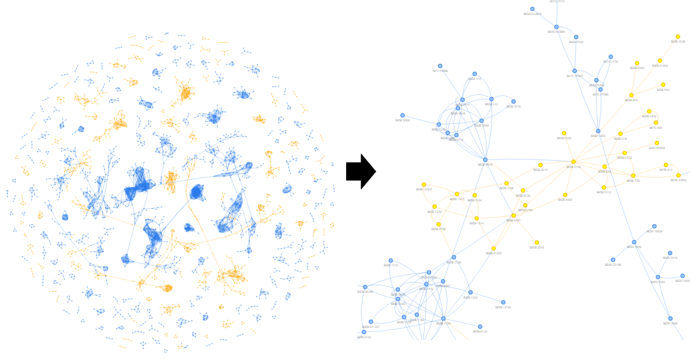
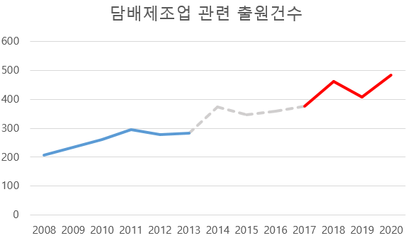

# 특허 DATA를 활용한 미래기술 위크시그널 분석2 - 특허 CPC 기반으로</img>

# Preview

- **제목** :  '[**특허 DATA의 CPC를 활용한 미래 기술 위크시그널 분석 및 성장 예측**](#)'
- **요약** : 현재 중요성을 아직 판단하기 어렵지만 잠재력에 대한 정보를 내포하고 있는 작은 신호 또는 징후를 위크시그널이라고 부릅니다. 특허는 매우 세밀한 기술적 특징을 담고 있는 문서로, 한국특허정보원에서는 국내 특허DATA의 CPC를 활용하여 위크시그널 판단 가능성을 확인하고자 합니다. 본 연구에서는 2001년부터 2019년간 약 321만 건의 문서에서 CPC 주분류 12만 개를 추출하였습니다. 이 CPC 주분류의 벡터 조합으로 새로운 기술 그래프를 만들었고 이것을 위크시그널로 표현하였습니다. 기존 방법과 다른점은 키워드를 이용한 기술 표현을 CPC subgroup으로 표현한 방법입니다. 대표 CPC 벡터 정보를 구축할 때는 한 문헌의 필드 별 정보의 평균으로 구축하고 문헌 벡터들의 평균으로 CPC subgroup 대표 벡터를 추출하였습니다. 또한 기술그룹 구축을 위한 유사성을 판단할 때도 특허 BERT 언어모델을 활용한 점도 다른 점이라고 할 수 있습니다. 전체 CPC 섹션을 모두 적용하였고 위크시그널의 성장성을 예측하는 모델을 구축한 점에서 새로운 시도가 됩니다. 이렇게 특허 임베딩 방법, 특허 전문 언어모델 활용 등 특허문헌의 자연어 처리 노하우를 접목하였고 미래 기술 위크시그널을 분석하는 점에서 의미있는 접근 방법이고 시도라고 볼 수 있습니다. 이러한 연구를 통해서 향후 특허 기반 인공지능 분석 관련 분야의 발전에 기여하고자 합니다.

- **연구부서** : 한국특허정보원 지능정보전략팀 연구실증파트 
- **연구자** : 민재옥, 박진우, 심우철, 김채은, 황솔빈

---

# Reference

> 이 글은 '[**KISTI DATA INSIGHT 제19호 : 미래기술 위크시그널 성장예측보고서**](https://www.kisti.re.kr/post/data-insight?t=1668036309836)'와 
> '[**KISTI DATA INSIGHT 제15호 : 미래기술 위크시그널**](https://www.kisti.re.kr/post/data-insight?t=1668036309836)'의 내용을 인용하였습니다.
> 아래 설명하는 실험들은 특허데이터만을 적용한 내용입니다.
> 또한 KISTI 미래기술 위크시그널 분석 방법이나 데이터에서 차이가 있음을 미리 알려드립니다. 

- **참고보고서 링크** : https://www.kisti.re.kr/post/data-insight?t=1668036309836
- **보고서** : KISTI DATA INSIGHT 제19호 : 미래기술 위크시그널 성장예측보고서
- **저자** : 양혜영, 하태현, 홍성화, 김소영

---

# 1. 미래 기술 위크시그널 - CPC코드 활용편
## 1.1. 위크시그널
> 위크시그널의 개념은 전략적 관리자로 알려진 Ansoff의 "Managing Strategic Surprise by Response to Weak Signals"라는 논문에서 기업이 외부변화로부터 받게 될 충격을 관리하기 위
> 해 충격을 야기할 수 있는 작은 신호로 사용되었습니다. 경험적 외삽으로는 설명하기 어렵고 그 중요성이 불분명하지만, 미래에 일어날 일들에 대한 정보를 담고 있는 작은 징후로 보기도 
> 합니다. 따라서 예전에는 전문가들이 토론을 거쳐서 결정하였고 급변하는 기술환경에서 빠르게 자동으로 판단하기 쉽지 않았습니다. 이에 따라 KISTI연구진은 위크시그널을 자동 탐지하는 방
> 법을 시도해보았고 한국특허정보원에서도 국내 특허데이터로 실험을 진행해보았습니다.

## 1.2 CPC코드 활용
> ```왜 CPC 코드를 활용할까?```

> 위에 기술된 위크 시그널의 기술 탐지는 결국 키워드 단위로 이용되는 것이고, 미래 기술을 키워드의 집합으로 탐지하게 됩니다. 그러나 특허에서는 전세계적으로 잘 활용하는 기술체계가 있습
> 니다. CPC(Cooperative Patent Code)로 기술을 최대 약 27만여개로 분류하는 코드가 이에 해당합니다. 마침 한국특허정보원에서는 CPC 자동분류 예측 인공지능 모델을 구축하였고 성능도 뛰
> 어나기 때문에 이를 활용해서 위크시그널에 적용해 보려고 합니다. 또한 단순히 키워드 단위로 기술을 표현하게되면 보통 우리가 겪게되는 키워드의 한계를 가지게 될 수 있습니다. 동음이의어
> 나 이음동의어로 생기는 의미 표현의 한계를 넘을 수 없기에 CPC 기술 단위로 위크시그널을 탐지하는데 큰 의미가 있다고 판단합니다.

### 1.3 CPC 코드 활용 위크시그널 자동탐지 프로세스
이 글에서는 혼동을 방지하기 위해 참고한 KISTI 미래기술 위크시그널 방식은 'KISTI 위크시그널'로 명명하고 특허데이터를 적용한 방식은 'KIPI 위크시그널'로 구분하여 설명드리겠습니다.

> ```KISTI 위크시그널 자동탐지 프로세스```
<p align="center">
</img>
</p>
</br>
</br>

> ```KIPI 위크시그널 자동탐지 프로세스```

> 기존 프로세스와 다른 점은 기술의 표현을 키워드의 집합으로 구성되던 것이 CPC subgroup의 집합으로 구성되는 것입니다. 따라서 키워드와 키프레이즈를 추출했던 과정이 CPC subgroup의 벡
터 추출로 대체됩니다. CPC subgroup 벡터는 해당되는 주분류의 문헌들의 벡터를 추출하고 그 평균으로 CPC subgroup의 대표가 됩니다. 또한 문헌 벡터를 추출할 때 제목, 초록, 배경기술 
, 기술분야 외에 청구항 벡터도 함께 추출하여 평균으로 문헌벡터를 만드는 부분도 다른점이 될 것입니다. 

<p align="center">
</img>
</p>

# 2. 위크시그널 자동탐지 실험

## 2.1 실험 데이터

- 2001년 ~ 2019년(출원연도 기준)
- 특허 공개공보 데이터 
- 전체 CPC(Cooperative Patent Classification)의 Subgroup 대상
- Subgroup 기준 주분류 128,395개
- 전체 특허 3,218,806건
- 대상 필드는 발명의 명칭, 요약, 배경기술, 기술분야, 청구항으로 적용

<p align="center">
</img>
</p>
</br>

## 2.2 CPC 집합 추출

> ```CPC Subgroup 별 모든 문서의 대표 벡터 추출```

- 문서 기준 : 3,218,806건
- subgroup 기준 : 128,395개 (주분류)

<p align="center">
</img>
</p>
<p align="center"> <위크시그널을 위한 연도별 특허 문헌 수></p>
</br>
<p align="center">
</img>
</p>
<p align="center"> <위크시그널을 위한 섹션 별 특허 문헌 수와 서브그룹> </p>
</br>

## 2.3 CPC 활동성 측정

> ```CPC 규모성, 활동성 측정```

> 기존 KISTI 논문에서의 비중과 같은 비중으로 적용하여 규모성과 활동성 기준을 정하였습니다. KISTI에서는 1636만 논문 중 규모성 적용 시 210만건으로 13%가 해당되고, 특허문헌도 21만 건> 중 규모성 적용 시 2만 5천건으로 약 13%에 해당하였고 활동성에서 빈도수가 5년 내 최근 1년 기준으로 하였을 때 기존 KISTI 논문의 비중과 동일하게 됨을 알 수 있습니다. 이런 이유로 규
> 모성과 활동성의 기준은 조건3, 조건4의 아래 내용과 같습니다. 

- 조건3. 규모성 = 빈도수(최근1년) >= 1
- 조건4. 활동성 = 빈도수(최근1년)/빈도수(5년) >= 0.5

## 2.4 Poping CPC 추출

> ```CPC 기술그룹 자동 생성```

> CPC 규모성, 활동성을 측정하여 적용 시 321만건 특허 중에서 20만건의 팝핑 문헌이 나오고, 이 문헌의 주분류를 확인해보면 9만 7천여개의 기술이 있슴을 알 수 있습니다. 팝핑 서브그룹은 > 섹션 별로 A섹션은 1만3천건, B섹션은 2만3천건, C섹션은 1만3천건, D섹션은 2천건, E섹션은 4천6백건, F섹션은 1만1천건, G섹션은 1만3천건, H섹션은 1만5천건이 나왔습니다. 주목할 점은 H섹션의 경우 111만건의 문헌에서 1만5천개 기술밖에 안나온것을 알 수 있습니다. 규모성, 활동성의 조건에 해당하는 문헌 수가 생각보다 적게 나왔고 팝핑 기술이라고 생각되는 기술 또한 
적게 나왔기 때문인 것으로 보입니다.

<p align="center">
</img>
</p>
<p align="center"> <위크시그널을 위한 섹션 별 특허 팝핑 문헌 수와 팝핑 서브그룹> </p>

## 2.5 CPC 기술그룹 자동생성

> ```CPC 기술그룹 자동생성```

> CPC 기술그룹을 형성하는 것은 기술을 CPC subgroup으로 연결된 그래프 형식으로 표현하는 작업이 됩니다. 아래 예시 첫번째 그림을 보면 'H01L 39/2461'과 H01L 39/2454, H01L 39/2441, 
> H01L 39/2464 기술들이 벡터 유사도 거리가 0.25이내로 의미적으로 가까운 기술로 볼 수 있어 그래프로 표현된 하나의 기술로 다시 볼 수 있습니다. 두번째 그림을 보면, E섹션으로 표현된 
> 그래프 기술그룹이 생성된 것을 볼 수 있습니다.


<p align="center">
</img>
</p>
<p align="center"> < CPC subgroup으로 연결된 기술그룹 그래프 예시> </p>
</br>

<p align="center">
</img>
</p>
<p align="center"> < E섹션 내 CPC subgroup으로 연결된 기술그룹 그래프 예시> </p>

## 2.6 CPC 기술그룹 통계

> ```CPC 기술그룹 통계```

> 321만건 특허 문헌은 subgroup 주분류 기준 12만 8천개 기술을 표현할 수 있고, 여기서 20만개 팝핑 문헌이 나오게 되고 팝핑 문헌 속 기술은 9만7천개가 나오게 됩니다. 9만 7천개 서브그
> 룹에서 기술그룹을 자동화 그래프 그룹핑하게되면 2만7천개의 기술들이 3,838개 그래프로 위크시그널을 보내게 됩니다. 아래 통계가 문헌 수와 서브그룹 기술 수 및 비중으로 표현되어 있습니다.

<p align="center">
</img>
</p>
<p align="center"> <위크시그널을 위한 섹션 별 weak signal 서브그룹 수> </p>
</br>

<p align="center">
</img>
</p>
<p align="center"> <위크시그널을 위한 섹션 별 weak signal 서브그룹 비중> </p>


## 2.7 CPC 기술그룹 시각화

> ```CPC 기술그룹 시각화```

> CPC 기술그룹을 형성하여 전체 섹션으로 보게 되면 문헌 기준 20만건의 팝핑 특허 문헌이 생기고 CPC subgroup 기준 9만 7천여개의 팝핑기술이 생기는 것을 알 수 있습니다. 또한 이 팝핑 기술들이 그래프로 그룹화 되어 3,838개 팝핑 기술 그룹(그래프)이 생성됩니다. 이로써 미래 기술로 3,838개 위크시그널이 발견되었습니다.

<p align="center">
</img>
</p>
<p align="center"> <3,383개 위크시그널 시각화> </p>
</br>
  
## 2.4 CPC 위크시그널 해석

> ```CPC 위크시그널 해석```

> 위크시그널로 나온 3,838개의 그래프들이 어떤 기술인지를 확인하기 위해서 CPC를 KSIC산업분류와 맵핑시켜 기술 파악하고 해석하려고 합니다. 따라서 산업(KSIC)-특허 연계표를 활용하여 기술을 해석해 보겠습니다.

<p align="center">
</img>
</p>
<p align="center"> <위크시그널 해석을 위한 산업분류와 특허분류의 맵핑표 적용> </p>

> ```KSIC 산업분류를 활용한 CPC 위크시그널 해석 방법```

> 산업분류로 맵핑표에서는 서브클래스 기준으로 맵핑되었기에 아래의 설명 방식대로 기술을 표현하였고, 너무 포괄적인 산업 분류명인 경우는 제거하였습니다. 따라서 61개 산업분류 중 3개가 
제거 됩니다.
  
<p align="center">
</img>
</p>
<p align="center"> < CPC특허분류를 산업분류로 맵핑하는 방법 예시> </p>
</br>

<p align="center">
</img>
</p>
<p align="center"> <너무 포괄적인 산업분류는 제거> </p>
  
## 3. CPC 코드 활용 위크시그널 성장 예측 

## 3.1 학습모델: Graph Convolutional Neural Network

> ```위크시그널의 성장추이 데이터를 기반으로 미래 위크시그널을 예측하는 그래프 모델```
  
- GCNN 모델은 그래프 특성을 convolutional neural network의 분석하는 방식으로, 그래프의 node prediction, link prediction, graph classification, prediction 가능
- 본 연구에서는 위크시그널을 구성하는 CPC subgroup 네트워크에 대해서 고성장으로 분류하는 graph classification 기능을 이용
- 특허 위그시그널의 10년 후 성장추이를 관찰하여 고성장하는 위크시그널 네트워크를 분류하는 네트워크 분류 모델을 개발
- KISTI 보고서에 내용과 일치하도록 Graph Convolutional Neural Network 모델이 구현된 파이썬 패키지 StellarGraph를 이용하였고 DeepGraphCNN 알고리즘을 활용
  
<p align="center">
</img>
</p>
<p align="center"> < GCNN 모델을 활용한 고성장 특허 예측 예시> *KISTI 미래기술 위크시그널 성장예측보고서 </p> 
  
## 3.2 학습데이터: 기준데이터, 성장데이터, 데이터 증강

#### 3.2.1 GCNN 학습데이터 구축

> ```CPC subgroup을 graph의 node로 feature와 함께 학습데이터로 구축```  

- Graph : node + edge + node_feature + edge_feature
- Node : CPC subgroup
- Edge : weak signal 연결
- Node feature : 5년간 연도별 특허수
- Edge feature : edge weight 유사도
  
> ```고성장 기술 라벨링 기준```  

> 특허수(성장데이터) - 특허수(기준데이터) >= 10

> 기준데이터는 과거 5년 기간 동안 weak signal로 출연한 특허수로 보고 성장데이터는 기준데이터의 10년 후 5년 기간 동안 해당 weak signal로 출연한 특허수라고 볼 수 있습니다. 예를 들
면 2001년에서 2006년을 기준데이터로 보면 예측하는 기간은 2011년에서 2016년을 대상으로 고성장 기술을 예측하게 됩니다.
  
<p align="center">
</img>
</p>
<p align="center"> < 기준데이터, 성장데이터 기준> </p>   
 
> ```학습데이터```  

- 학습데이터 : 23,540건 (2,354건을 1/30을 표준편차로 하는 normal random noise를 적용하여 10배 확장)
- 학습데이터 기간 : 2001년에서 2007년 특허 데이터
- 평가데이터 : 266건(89건 고성장, 177건 非고성장)
- 평가데이터 기간 : 2008년에서 2010년 특허 데이터
  
<p align="center">
</img>
</p>
<p align="center"> < 고성장 예측 모델 라벨링 후 학습데이터> </p>   
  
#### 3.2.2 GCNN 모델 설계

> ```GCNN 모델 layer 설계```  

> GCNN 분류 모델은 KISTI 보고서에서 제시한 동일한 layer를 적용하여 실험하였습니다. 
  
<p align="center">
</img>
</p>
<p align="center"> < GCNN 모델 설계> *KISTI 미래기술 위크시그널 성장예측보고서 </p>   
  
#### 3.2.3 GCNN 모델 학습

> ```GCNN 모델 학습```  

- 10 ephoc 학습
- 10 batch 학습
- binary accuracy : 98.36 %
- val_bianary accuracy : 98.14%
  
#### 3.2.4 GCNN 모델 평가 및 분석

> ```고성장 특허 예측 모델 평가```  

- 평가데이터 : 2008년에서 2010년 특허 데이터
- 10 batch 학습
- accuracy : 97.44%

<p align="center">
</img>
</p>
<p align="center"> < 학습데이터와 평가데이터 > </p>  
  
## 3.3 학습모델 성능 및 2022 위크시그널에 대한 성장성 예측결과

> ```고성장 특허 예측결과```  

> 2011년부터 2022년까지 비금속광물제품 제조업부터 의료용 기기 제조업, 자동차 제조업, 항공기 제조업 등 weak signal의 예측 흐름을 파악할 수 있습니다. 주목할 점은 2018년에서 2022년 예측결과 고성장 기술로 Top1으로 '담배제조업'이 예측되었습니다. '담배제조업'은 특허 키워드를 활용한 위크시그널 부분에서 2019년 위크시그널로 전자 담배 관련 키워드로 '담배' 분야가 분석되었습니다. 기반 특징이 CPC subgroup을 통해 나온 벡터 결과와 특허 내 키워드로 나온 결과와 일치하는 점에서는 매우 흥미롭습니다. 하지만 산업분류가 서브클래스 혹은 메인클래스까지만 맵핑되는 점, 그래프 데이터의 불균형 등 해석과정에서 일어날 수 있는 손실이 있었고 KIPI DATA INSIGHT 제1호에서 키워드를 통한 위크시그널 방식이 GCNN을 통해 고성장 예측을 진행해 보지 못하였기 때문에 정확한 결과는 확인 할 수 없었습니다. 그럼에도 특허를 통한 weak signal를 파악할 떄, 특허의 특징이 두드러지게 나타날 수 있는 CPC나 키워드 방식은 기술을 파악하는데에 있어서 의미있는 접근방식이고 새로운 시도라고 볼 수 있는 실험이었습니다.
  
</br>
<p align="center">
</img>
</p>
<p align="center"> <연도별 위크시그널 고성장 예측 Top1~5 > </p>   
</br>

> ```국내 특허 내 담배 제조업 관련 연도별 출원건수```

> 담배제조업의 경우 2008년에서 2013년의 그래프 데이터를 보고 10년 후 위크시그널 고성장 데이터로 예측하였습니다. 이를 확인하기 위해 실제 국내 특허 내 청구범위에서 '담배'라는 키워드가 사용된 통계를 보면 아래와 같습니다. 실제로 2008년에서 2010년까지 702건에 해당하는 담배제조업 출원 건수가 10년 후 2018년에서 2020년까지 1,355건으로 2배 넘게 급성장 하였습니다. 아래 차트에서 파란색 부분이 분석기간이 되고 빨간색 부분이 예측하는 예상기간이 됩니다. 키워드 혹은 키프레이즈를 활용한 위크시그널과 맞물려서 CPC를 활용한 위크시그널 또한 고성장 데이터로 예측이 동일하게 잘 된 것을 볼 수 있습니다.

</br>
<p align="center">
</img>
</p>
<p align="center"> < 담배 제조업 관련 연도별 출원건수 그래프> </p>   

</br>
<p align="center">
</img>
</p>
<p align="center"> < 담배 제조업 관련 연도 별 출원건수 통계> </p>   


---

# 4. Conclusion

* 국내 특허 데이터를 활용하여 기술적 잠재력를 파악하는데 의미있는 사례로 보임
* 본 연구에서 개발한 위크시그널 성장예측모형은 97.44%의 정확도 성능을 달성하였고, 이를 위크시그널 3,383개에 적용
* 위크시그널 3,383개 중 10년 후 미래에 고성장 할 것으로 예측된 것은 총 1131개로 33.4%에 해당
* 2018년부터 2022년 기간 동안 키워드 기반 위크시그널과 CPC 기반 위크시그널의 공통점으로 '담배제조업'이 고성장 기술로 떠오름
* 특허 전문가들이 판단에 용이할 수 있는 CPC 기술분류체계지만 CPC만을 사용하여 모든 기술을 표현하는 데에 한계가 존재
* CPC subgroup을 기초로 했지만 문헌 수가 적은 특정 subgroup 경우 한계가 존재하고 이럴 경우 maingroup으로 변경하던가 새로운 체계로 대채 할 수 있는 지에 대한 실험 필요
* 본 연구는 특허 기술분류 기준으로 기술적 거리를 측정하였는데 키워드 및 키프레이즈의 방식의 결합을 통한 의미적 유사성 판단에 대한 연구가 필요
* 특허 문헌 예측 기간을 늘리고 줄여서 예측에 적합한 기간을 설정하는 실험 필요
* 키워드 기반 위크시그널과 동일하게 CPC 기반 위크시그널을 해석하는 각 기술분야 전문가의 해석이 필요한 문제점이 존재하고 더 나아가 그래프로 표현된 새로운 융합 기술들을 판단하는 해석의 한계 존재
* 결과 있어서 특허 속성으로 규모성, 활동성, 경향성의 기존연구에서 사용한 기본적인 통계적 비율이나 수치를 적용하였기에 해석에 유의
* 본 연구를 통해 향후 국내 특허 데이터를 활용한 기술적 평가나 가치 평가 관련 연구를 진행하는 연구자들에게 좋은 레퍼런스가 될 것으로 기대
